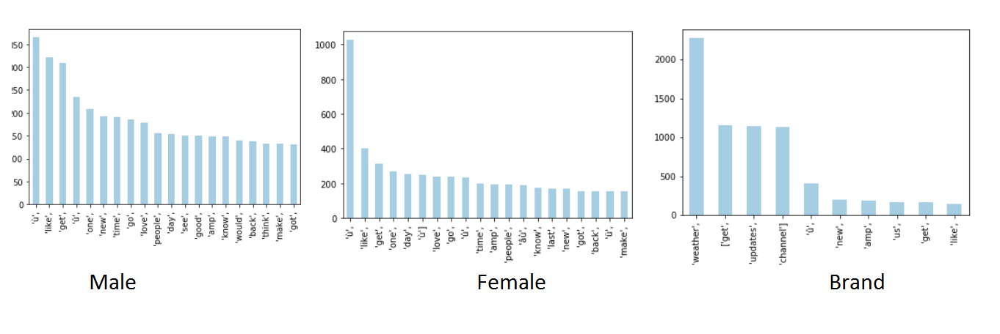
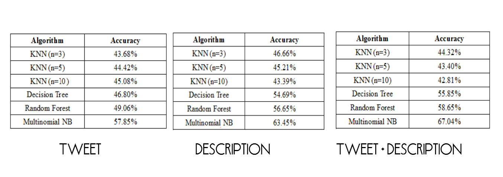

# Gender Classification Based On Tweets And User Description
A research was conducted on twitter dataset that was retrieved from Kaggle.com

This data set was used to train a CrowdFlower AI gender predictor. The dataset contains 20,000 rows, each with a user name, a random tweet, account profile and image, location, and even link and sidebar color. The 3 labels are Male, Female and Brand.

Bag of words model was generated for Tweets, User bio and the concatenation of Tweet+UserBio to predict the gender of the twitter account.

First step was to remove non-letters using the sub function. The Second step we took was to convert to lower case by using lower and split into individual words. The third step was to identify the stop words used in the tweets and remove them, because stop words are used to denote grammar of a sentence and cannot be used to classify the gender of a person.

The count of words exploited are given below:

Algorithms used:   
KNN (Neighbors =3,5,10)  
Decision Tree  
Random Forest  
Multionomial Naïve Bayes  

Features used:  
Bag of words model on Tweets  
Bag of words model on Description  
Bag of words model on Description+Tweets  

The result on every set are given below:

Any update on the accuracy would be highly appreciated
